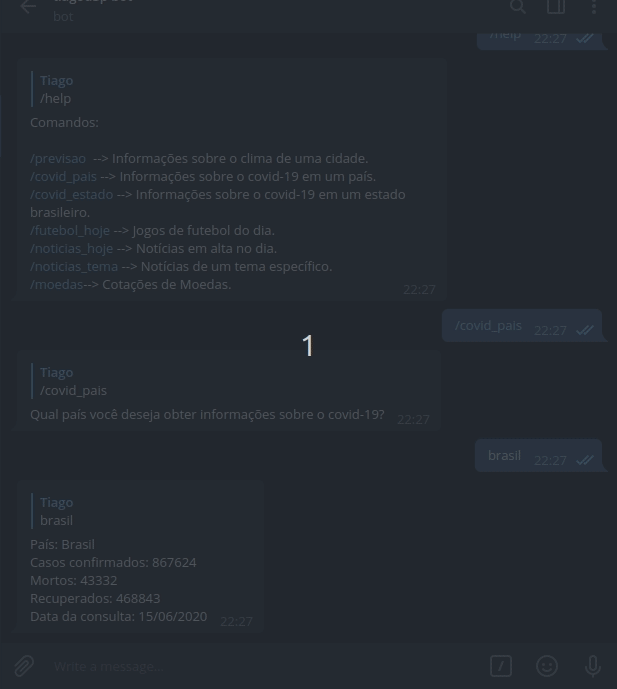

<h1 align="center">
    Assistente Virtual Tiagod3p BOT
</h1>

<p align="justify"> Um assistente virtual desenvolvido em Python integrado com a plataforma Telegram. </p>

<p align="center">
  <a href="#rocket-tecnologias">Tecnologias</a>&nbsp;&nbsp;&nbsp;|&nbsp;&nbsp;&nbsp;
  <a href="#projeto">Projeto</a>&nbsp;&nbsp;&nbsp;|&nbsp;&nbsp;&nbsp;
  <a href="#como-rodar-a-aplicação">Como rodar a aplicação</a>&nbsp;&nbsp;&nbsp;|&nbsp;&nbsp;&nbsp;
  <a href="#funcionalidades">Funcionalidades</a>&nbsp;&nbsp;&nbsp;|&nbsp;&nbsp;&nbsp;
  <a href="#como-contribuir">Como contribuir</a>&nbsp;&nbsp;&nbsp;|&nbsp;&nbsp;&nbsp;
  <a href="#octocat-desenvolvedores-e-contribuintes">Desenvolvedores e Contribuintes</a>
</p>

<br>

<p align="center">
  
  
</p>

## :rocket: Tecnologias

Esse projeto foi desenvolvido com as seguintes tecnologias:

- [Python 3.8.2](https://www.python.org/)
- [pyTelegramBotAPI](https://pypi.org/project/pyTelegramBotAPI/)

## 💻 Projeto

O Assistente Virtual (tiagod3p bot) é um projeto que visa facilitar a vida dos usuários oferecendo a eles informações e automações de tarefas através de um simples digitar de comandos.

> Status do Projeto: Em desenvolvimento :warning:


## ▶ Como rodar a aplicação

No terminal, clone o projeto: 

```
$ git clone https://github.com/tiagod3p/math-algorithms.git

$ cd math-algorithms
```

Instale as dependência:

```
$ pip install -r requirements.txt
```

Inicie a aplicação:
```
$ python3 bot.py
```

Abra o seu telegram e inicie uma conversa com o [tiagod3p-bot](t.me/tiagod3p_bot)

## 🔨 Funcionalidades

- Previsão do tempo  --> Informações sobre o clima de uma cidade.
- Covid-19 --> Informações sobre o covid-19 em um país ou estado brasileiro.
- Futebol --> Jogos de futebol do dia e os canais onde o jogo irá passar.
- Notícias --> Notícias em alta no dia ou sobre um tema específico.
- Cotações --> Cotações de Moedas e Criptomoedas.

Caso queira adicionar qualquer nova funcionalidade não hesite, contribua para o projeto.

## 🤔 Como contribuir

- Faça um Fork do projeto
- Cria uma branch com a sua feature: `$ git checkout -b minha-feature`;
- Faça commit das suas alterações: `$ git commit -m 'feat: Minha nova feature'`;
- Faça push para a sua branch: `$ git push origin minha-feature`.
- Abra uma Pull Request

Depois que o merge da sua pull request for feito, você pode deletar a sua branch.

Você pode me enviar quantos PR's quiser, eu ficarei honrado em analisá-los e aceitá-los! E se você tiver qualquer dúvida sobre o projeto...

Contacte-me por e-mail: tiagooliveiravidaldepaula@gmail.com

Ou conecte-se comigo pelo [LinkedIn](https://www.linkedin.com/in/tiagovidaldepaula/) ou [Twitter](https://twitter.com/tiagod3p)

Muito obrigado!

## :octocat: Desenvolvedores e Contribuintes

| [<br><sub>Tiago Vidal</sub>](https://github.com/tiagod3p) |
| :---: | :---: | :---: 
